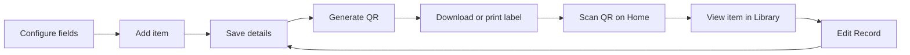

# QR-Based Item Management System

**QR Item Manager** is a local Streamlit app for organising items with custom
fields and QR labels. Create an item record, save its details, generate a label,
then scan it to open the record in Library.

This is the **project-1-item-manager2** branch, which uses the bundled jsQR
decoder and defaults to **http://localhost:8502**. The original port-8501 version
is kept separately in the owner's private `private-project` repository.

## Purpose

Keep item information organised and easy to find with a QR label. QR Item Manager
is designed for individuals and teams managing everyday items, books, tools,
supplies, or equipment at home, in a library, workshop, university, or workplace.

Choose up to **six custom fields** to match what you organise: for example,
ItemName, Location, Owner, SerialNo, Service, or CheckDate. Each field can hold
**Text / Number** or a **Date**. Everyone uses the same field settings in one
installation, so you can adapt the system without changing code.

This is a simple item-record tool. It does not include borrowing workflows,
stock accounting, or user access controls. See [Current scope](#current-scope)
and [Licensing](#licensing) for its limits and reuse status.

Repository: `QR-Item-Manager` · App name: **QR Item Manager**

This repository contains two projects. Project 1 also has a separate jsQR
migration branch:

| Branch | Contents |
| --- | --- |
| [main](https://github.com/syazanne/QR-Item-Manager/tree/main) | General repository introduction. |
| [project-1-item-manager2](https://github.com/syazanne/QR-Item-Manager/tree/project-1-item-manager2) | **This version:** QR Item Manager with jsQR, default port **8502**. Follow the instructions below. |
| [project-2-ai-prototype](https://github.com/syazanne/QR-Item-Manager/tree/project-2-ai-prototype) | AI-assisted manual/support prototype, with its own setup instructions. |

**New here?** Follow the [step-by-step user guide](docs/USER_GUIDE.md), covering
field setup, your first item, QR labels, scanning, updates, and Backup & Restore.
You can also open **How to use** below the Scan QR button on Home.

## How it works



## Features

- Permanent Record IDs, such as `REC-0001`, never reused after deletion.
- Up to six custom fields with **Text / Number** or **Date** inputs.
- Calendar inputs with day-first, month-first, or year-first display.
- Search by Record ID or saved field values in Manage and Library.
- Browser camera scanning, QR image downloads, and printable QR labels.
- Per-field saving, unsaved-change prompts, and last-updated timestamps.
- Backup ZIP downloads and validated restore with an automatic safety copy.

## What you need

| Requirement | What it is for |
| --- | --- |
| **Python 3.9 or later, except 3.9.7** | Required by the checked package versions. Tested with Python **3.9.6**; see step 3 to check your installation. |
| **A terminal** | Runs the setup commands. Use your computer's Terminal app or the terminal inside VS Code. |
| **A browser** | Displays the app. Chrome and Brave have been used during development. |
| **Internet access for setup** | Downloads the project and its Python packages. |
| **A camera, if you want to scan QR labels** | A built-in webcam or connected camera works. You can still browse and edit records without scanning. |

**VS Code and Git are optional.** Download ZIP works without Git, and you do not
need a code editor just to run the app. A printer is only needed for paper labels.
No separate database server, user account inside the app, or API key is required.

You do **not** need to download Streamlit or the other Python packages manually.
After Python is installed, the command in **step 5** installs everything listed
in [requirements.txt](requirements.txt): Streamlit, qrcode, Pillow, and pypdf.
The jsQR browser decoder and its license are already included in the repository;
no separate scanner package or npm installation is needed.

## Run locally

Follow these steps on **macOS/Linux**. Downloading the ZIP gives you the code;
you then run it on your computer and use it in your browser.

1. **Download Project 1 from GitHub.**

   Open the [jsQR migration branch](https://github.com/syazanne/QR-Item-Manager/tree/project-1-item-manager2).
   Check that the branch selector says **project-1-item-manager2**, then click
   **Code → Download ZIP**. The `main` branch only contains the repository introduction.
   If the repository is private, sign in with an account that has access.

2. **Extract the ZIP and open its folder in a terminal.**

   Extract the downloaded ZIP. Open the folder containing **app.py** and
   **requirements.txt**. For example, in VS Code choose **File → Open Folder**,
   select that extracted folder, then choose **Terminal → New Terminal**.
   Run the remaining commands in this terminal, one step at a time.

3. **Check that Python is installed.**

   ```bash
   python3 --version
   ```

   You should see Python **3.9 or later**. Streamlit 1.50.0 excludes Python
   **3.9.7**. If your version meets these requirements, continue to step 4.
   If Python is missing or your version does not meet them:

   - **macOS:** download a Python 3 installer from the
     [official Python website](https://www.python.org/downloads/macos/), open it,
     and follow the installation steps.
   - **Linux:** install Python 3 using your distribution's package manager. See
     the [official Python Linux guidance](https://docs.python.org/3/using/unix.html#on-linux).
     Make sure your installation includes pip and the venv module for the next steps.

   After installation, reopen the terminal in the project folder
   and run `python3 --version` again. Install Python before trying any `pip` or
   `streamlit` command.

4. **Create and activate the project's Python environment.**

   This keeps the app's packages separate from your other projects.

   ```bash
   python3 -m venv .venv
   source .venv/bin/activate
   ```

5. **Install the required packages.**

   ```bash
   python -m pip install -r requirements.txt
   ```

   This downloads and installs all the app's Python packages into the environment
   from step 4. You do not need to install them one by one. Wait for installation
   to finish successfully before continuing.

6. **Start the app.**

   ```bash
   python -m streamlit run app.py
   ```

   Keep this terminal open while using the app.

7. **Open the app in your browser.**

   If it does not open automatically, copy the **Local URL** shown in the
   terminal into your browser. This branch defaults to **http://localhost:8502**.
   You should see **QR Item Manager**. Continue with [First record](#first-record)
   below to set up fields and add your first item.

To stop the app, press **Ctrl+C** in the terminal. Next time, open a terminal in
the same project folder and run these two commands; you do not need to download
the project or reinstall its packages each time:

```bash
source .venv/bin/activate
python -m streamlit run app.py
```

Records are saved on your computer in SQLite and remain after the app is stopped.
No separate database server is required.

<details>
<summary>Alternative: get the code with Git instead of downloading a ZIP</summary>

With Git installed, run:

```bash
git clone --branch project-1-item-manager2 https://github.com/syazanne/QR-Item-Manager.git
cd QR-Item-Manager
```

Then continue from **step 3** above in the same terminal.

</details>

Tested with Python **3.9.6** and Streamlit **1.50.0**. Package minimum versions
are listed in `requirements.txt`; pip may select different versions for your
Python version and operating system. The exact reviewed development versions
are recorded in the [dependency inventory](docs/licenses/README.md).
To use a different port, for example **8503**, run
`python -m streamlit run app.py --server.port 8503`.

### Original checkpoint

The original `project-1-item-manager` branch is stored in the separate private
`private-project` repository. It has been removed as a branch from this public
repository. This jsQR version runs independently and does not need the original
app or its `streamlit-qrcode-scanner` package installed.

To run the original again, use a separate folder and Python environment, follow
that branch's README, and start it with `--server.port 8501`. Saved data belongs
to each folder; different ports alone do not isolate data or synchronise it.

The license review covers this jsQR version. Removing the old branch does not
erase shared Git history; other branches and earlier revisions are outside this
review. See [Sharing this version](docs/LICENSING.md#sharing-this-version).

## Pages

| Page | Purpose |
| --- | --- |
| **Home** | Press the circular **Scan QR** button to open the camera. A successful scan opens the item's Library view. **How to use** opens the user guide. |
| **Library** | Search and view saved records. **Scan another QR** opens the scanner for the next item; **Edit Record** opens editable details. |
| **Manage** | Add, search, edit, or delete records, and generate, download, or print QR labels. |
| **Admin Panel** | Configure **Field Settings** and use **Backup & Restore**. |

## First record

1. Open **Admin Panel → Field Settings**. Name a field, choose its type, and
   click its **Save** button. Use **Add** for more fields.
2. Open **Manage → Add**. The app creates an empty record with a permanent ID.
3. Click its **Record ID**, enter the item details, and **Save** each edited field.
4. Click **Generate QR**. At least one nonblank field value must be saved, and
   there must be no unsaved field edits.
5. Download the QR image or print a label. **DONE** returns to Manage.
6. Open **Home → Scan QR** and scan the label to view the saved record in Library.

Changing a saved value keeps the same Record ID and QR. The QR contains only the
Record ID, not the item's field values or a website URL. A general phone camera
may show the ID as text; use the app's scanner to open its record.

## Data behaviour

- Save each edited field separately. **Unsaved** marks a draft; **Saved ✓**
  confirms a save. DONE and sidebar navigation prompt before discarding drafts.
- Text / Number keeps values as entered, including leading zeroes. Date fields
  store ISO dates and display the selected format. Ambiguous older text dates
  require review; the app never guesses their meaning.
- Last updated is shown in UTC. It tracks saved record changes, not a history of
  edits. Viewing, printing, unchanged saves, or generating QR do not update it.
- Deleting a record or removing a field asks for confirmation. Removing a field
  also deletes its values from every record. Record IDs are never reused.
- Clearing all saved nonblank values resets QR status. Save a value and generate
  QR again to reactivate it. The permanent ID still matches previously printed labels.

See the [user guide](docs/USER_GUIDE.md) for field setup, calendar examples,
editing, label printing, and camera troubleshooting, including Brave playback.

## Backup & Restore

In **Admin Panel → Backup & Restore**, choose **Create backup → Download backup
ZIP** to save records, field settings, values, timestamps, and active QR images.
Only saved changes are included.

Upload a ZIP to review it, then choose **Review restore → Restore and replace**
to replace current records and field settings. Restore does not merge datasets.
Before replacement, a safety copy is saved locally; retrieve it with **Download
previous data** and upload it through Restore to recover the earlier state.

Invalid archives are rejected. Compressed and expanded size limits are 100 MB
(100 × 1024 × 1024 bytes). A ZIP can contain up to 10,001 entries: its manifest
and up to 10,000 QR images. This archive limit is separate from Record ID numbering.
Restore uses a database transaction and separate QR files; failure rolls back
records, and a failed safety backup prevents replacement. IDs, values, and
original timestamps are preserved. Active QR images are rebuilt from the IDs;
missing images are reported and remain unavailable. Old QR-MedTech backups are
still accepted.

Keep downloaded backups on separate storage as well as this computer. See the
[backup instructions](docs/USER_GUIDE.md#7-back-up-your-data) for the full workflow.

## Project structure and storage

| Path | Purpose |
| --- | --- |
| `app.py` | Streamlit pages, navigation, forms, and dialogs. |
| `database.py` | SQLite schema, migration, and record operations. |
| `field_utils.py` | Field types, date parsing, and display formats. |
| `qr_utils.py` / `label_utils.py` | QR images and printable labels. |
| `scanner.py` / `scanner_frontend/` | Browser camera preview and decoding. |
| `backup_utils.py` | Backup validation, export, and restore. |
| `tests/` | Database, UI flow, backup, label, and scanner tests. |
| `docs/USER_GUIDE.md` | Step-by-step instructions, also shown inside the app. |
| `.streamlit/config.toml` | Sets this branch's default port to 8502. |
| `LICENSE` / `THIRD_PARTY_NOTICES.md` | MIT license for original code and notices for third-party components. |
| `docs/LICENSING.md` / `docs/licenses/` | Review scope, dependency inventory and retained license texts. |
| `data/machines.db` | Local database; the existing filename is retained. |
| `data/backups/` | Automatic ZIP copies made before restore. |
| `qr_codes/` | Generated and restored QR images. |
| `data/scanner_component_jsqr/` | Generated local scanner assets, including the decoder license. |
| `scanner_frontend/vendor/` | Unmodified jsQR 1.4.0, its full license and attribution. |

Local databases, QR images, backups, and generated scanner assets are excluded
from Git. Legacy tables and unused QR files are retained locally; deleting a
record removes its active database values, not every historical asset.

Older databases are migrated at startup while preserving IDs and values.
Standalone PDF helpers and compatibility code are kept for reference; see
[retained reference code](docs/REFERENCE.md) for what remains and why.

## Current scope

The app supports local item management. Library is a read-only view, not an
access-control role: there is no login, and anyone with app access can navigate
to Manage and Admin Panel. Viewer/admin permissions are a next step if the app
will be shared with other users.

The interface and user guide are currently in English. Bahasa Melayu and
Japanese options are planned but are not implemented in this version.

Lists currently display all matching records without pagination. Pagination is
an option if the collection grows large. Last updated records only the latest
timestamp, not a history of edits or who made them.

## Licensing

Streamlit is free, open-source software under Apache 2.0; running this app locally
does not require a paid Streamlit subscription. Hosting services can have their
own prices and terms. See [Streamlit's terms](https://streamlit.io/terms-of-use).

The original code and documentation in this branch use the [MIT License](LICENSE),
copyright 2026 syazanne. You can use, modify and redistribute them, including
commercially, while retaining the license and copyright notice.

Third-party software keeps its own licenses. The bundled **jsQR 1.4.0** decoder
uses **Apache-2.0**, with its full license and attribution included. Keep
[THIRD_PARTY_NOTICES.md](THIRD_PARTY_NOTICES.md) and the supplied third-party
license files when sharing this checkout. Python dependencies are installed
separately by pip; do not include your `.venv` or local data in a source release.

See the [license review](docs/LICENSING.md) for the checked versions, dependency
inventory and distribution scope. This review covers the jsQR migration branch
(port 8502); it does not cover the original decoder on port 8501 or Project 2.

## Tests

```bash
.venv/bin/python -m unittest discover -s tests -v
```

Tests use temporary databases and QR directories. Coverage includes migrations,
permanent IDs, field settings, record editing, date formats, search, navigation
prompts, delete confirmations, QR reset behaviour, label PDF output, backup
round trips, invalid archives, rollback, and restore confirmation/cancellation.

Scanner lifecycle tests use a simulated camera with JavaScriptCore on macOS.
Automated tests do not replace checking real camera playback or physical printing
on the devices you plan to use.
