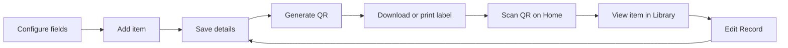

# QR-Based Item Management System

**QR Item Manager** is a local Streamlit app for organising items with custom
fields and QR labels. Create an item record, save its details, generate a label,
then scan it to open the record in Library.

Repository: `QR-Item-Manager` · App name: **QR Item Manager**

**New here?** Follow the [step-by-step user guide](docs/USER_GUIDE.md), covering
field setup, your first item, QR labels, scanning, updates, and Backup & Restore.
You can also open **How to use** below the Scan QR button on Home.

## How it works



## Features

- Permanent Record IDs, such as `REC-0001`, never reused after deletion.
- Up to six custom fields with **Text / Number** or **Date** inputs.
- Calendar inputs with day-first, month-first, or year-first display.
- Search by Record ID or saved field values in Manage and Library.
- Browser camera scanning, QR image downloads, and printable QR labels.
- Per-field saving, unsaved-change prompts, and last-updated timestamps.
- Backup ZIP downloads and validated restore with an automatic safety copy.

## Run locally

Tested with Python 3.9.6 and Streamlit 1.50. Dependencies are listed in
`requirements.txt`. These commands are for macOS/Linux.

```bash
git clone --branch project-1-equipment-manager https://github.com/syazanne/QR-Item-Manager.git
cd QR-Item-Manager
python3 -m venv .venv
source .venv/bin/activate
pip install -r requirements.txt
streamlit run app.py
```

The clone command selects the item-manager branch explicitly because this
repository also contains project-2 branches.
The repository is private, so cloning requires an account with access. If you
already have the project, run the setup commands from its existing folder.
Open the local URL printed by Streamlit. To choose a port, use
`streamlit run app.py --server.port 8502`.

Records are stored locally in SQLite; no separate database server is required.

## Pages

| Page | Purpose |
| --- | --- |
| **Home** | Press the circular **Scan QR** button to open the camera. A successful scan opens the item's Library view. **How to use** opens the user guide. |
| **Library** | Search and view saved records. The **Edit Record** button on a record opens its editable details. |
| **Manage** | Add, search, edit, or delete records, and generate, download, or print QR labels. |
| **Admin Panel** | Configure **Field Settings** and use **Backup & Restore**. |

## First record

1. Open **Admin Panel → Field Settings**. Name a field, choose its type, and
   click its **Save** button. Use **Add** for more fields.
2. Open **Manage → Add**. The app creates an empty record with a permanent ID.
3. Click its **Record ID**, enter the item details, and **Save** each edited field.
4. Click **Generate QR**. At least one nonblank field value must be saved, and
   there must be no unsaved field edits.
5. Download the QR image or print a label. **DONE** returns to Manage.
6. Open **Home → Scan QR** and scan the label to view the saved record in Library.

Changing a saved value keeps the same Record ID and QR. The QR contains only the
Record ID, not the item's field values or a website URL. A general phone camera
may show the ID as text; use the app's scanner to open its record.

## Data behaviour

- Save each edited field separately. **Unsaved** marks a draft; **Saved ✓**
  confirms a save. DONE and sidebar navigation prompt before discarding drafts.
- Text / Number keeps values as entered, including leading zeroes. Date fields
  store ISO dates and display the selected format. Ambiguous older text dates
  require review; the app never guesses their meaning.
- Last updated is shown in UTC. It tracks saved record changes, not a history of
  edits. Viewing, printing, unchanged saves, or generating QR do not update it.
- Deleting a record or removing a field asks for confirmation. Removing a field
  also deletes its values from every record. Record IDs are never reused.
- Clearing all saved nonblank values resets QR status. Save a value and generate
  QR again to reactivate it. The permanent ID still matches previously printed labels.

See the [user guide](docs/USER_GUIDE.md) for field setup, calendar examples,
editing, label printing, and camera troubleshooting, including Brave playback.

## Backup & Restore

In **Admin Panel → Backup & Restore**, choose **Create backup → Download backup
ZIP** to save records, field settings, values, timestamps, and active QR images.
Only saved changes are included.

Upload a ZIP to review it, then choose **Review restore → Restore and replace**
to replace current records and field settings. Restore does not merge datasets.
Before replacement, a safety copy is saved locally; retrieve it with **Download
previous data** and upload it through Restore to recover the earlier state.

Invalid archives are rejected. Compressed and expanded size limits are 100 MB.
Restore uses a database transaction and separate QR files; failure rolls back
records, and a failed safety backup prevents replacement. IDs, values, and
original timestamps are preserved. Active QR images are rebuilt from the IDs;
missing images are reported and remain unavailable. Old QR-MedTech backups are
still accepted.

Keep downloaded backups on separate storage as well as this computer. See the
[backup instructions](docs/USER_GUIDE.md#7-back-up-your-data) for the full workflow.

## Project structure and storage

| Path | Purpose |
| --- | --- |
| `app.py` | Streamlit pages, navigation, forms, and dialogs. |
| `database.py` | SQLite schema, migration, and record operations. |
| `field_utils.py` | Field types, date parsing, and display formats. |
| `qr_utils.py` / `label_utils.py` | QR images and printable labels. |
| `scanner.py` / `scanner_frontend/` | Browser camera preview and decoding. |
| `backup_utils.py` | Backup validation, export, and restore. |
| `tests/` | Database, UI flow, backup, label, and scanner tests. |
| `docs/USER_GUIDE.md` | Step-by-step instructions, also shown inside the app. |
| `data/machines.db` | Local database; the existing filename is retained. |
| `data/backups/` | Automatic ZIP copies made before restore. |
| `qr_codes/` | Generated and restored QR images. |
| `data/scanner_component/` | Generated local scanner assets. |

Local databases, QR images, backups, and generated scanner assets are excluded
from Git. Legacy tables and unused QR files are retained locally; deleting a
record removes its active database values, not every historical asset.

Older databases are migrated at startup while preserving IDs and values.
Standalone PDF helpers and compatibility code are kept for reference; see
[retained reference code](docs/REFERENCE.md) for what remains and why.

## Current scope

The app supports local item management. Library is a read-only view, not an
access-control role: there is no login, and anyone with app access can navigate
to Manage and Admin Panel. Viewer/admin permissions are a next step if the app
will be shared with other users.

Lists currently display all matching records without pagination. Pagination is
an option if the collection grows large. Last updated records only the latest
timestamp, not a history of edits or who made them.

## Tests

```bash
.venv/bin/python -m unittest discover -s tests -v
```

Tests use temporary databases and QR directories. Coverage includes migrations,
permanent IDs, field settings, record editing, date formats, search, navigation
prompts, delete confirmations, QR reset behaviour, label PDF output, backup
round trips, invalid archives, rollback, and restore confirmation/cancellation.

Scanner lifecycle tests use a simulated camera with JavaScriptCore on macOS.
Automated tests do not replace checking real camera playback or physical printing
on the devices you plan to use.
